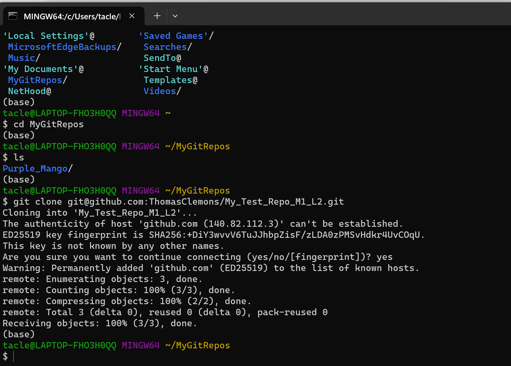

# My_Test_Repo_M1_L2
This is a test repo that I created for Module 1 exercise practice

# Changes made at 5:52pm

# Test Header (Header 1 size)

## Test Header (Header 2 size)

### Test Header (Header 3 size)

**Bold Text looks like this**

*Italics looks like this*

**Hyperlink to Google -- **[Google link](https://www.google.com)

*Received SSH Warning when trying to clone repo*

***End of File***